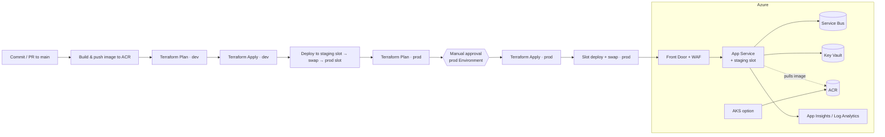

# azure-devops-iac-pipelines


> End-to-end **Infrastructure-as-Code + CI/CD** for running containerized microservices on Azure — reusable Terraform modules for App Service, AKS, Front Door (WAF), Key Vault, Service Bus and ACR, deployed through multi-stage **Azure DevOps YAML pipelines** with blue/green slot swaps.

---

## 🏗️ Architecture & CI/CD Flow



Traffic enters through **Azure Front Door** (with a WAF policy), reaching the **App Service** which runs the container pulled from **ACR** via managed identity. Secrets resolve from **Key Vault**, async messaging uses **Service Bus**, and telemetry flows to **Application Insights / Log Analytics**. **AKS** is wired in as an alternative compute target.

---

## ✨ Features

- **Reusable Terraform modules** — `resource-group`, `vnet`, `app-service` (with deployment slots), `aks`, `key-vault`, `service-bus`, `application-insights`, `front-door` (WAF), `acr`.
- **Composable environments** — `dev` and `prod` roots compose the modules; remote state in an Azure Storage backend (AzureAD auth, no stored keys).
- **Multi-stage Azure Pipelines** — `Build → Plan(dev) → Deploy(dev) → Plan(prod) → Deploy(prod)` with a manual approval gate on the prod Environment.
- **Blue/green releases** — image is deployed to a **staging slot**, health-checked, then **swapped** into production for near-zero-downtime, instantly reversible deploys.
- **Reusable pipeline templates** — `terraform-plan`, `terraform-apply`, `docker-build-push`, `appservice-slot-deploy`.
- **Both CI systems** — Azure Pipelines for delivery + a **GitHub Actions** workflow (`fmt`/`validate`/`tflint`/`tfsec`) to show portability.
- **Security-first** — Key Vault–backed variable group, workload-identity service connection (no secrets in YAML), WAF, managed identity ACR pulls, least-privilege RBAC.

---

## 🗂️ Repository Structure

```
.
├── azure-pipelines.yml                # multi-stage CI/CD entrypoint
├── pipelines/templates/
│   ├── terraform-plan.yml
│   ├── terraform-apply.yml
│   ├── docker-build-push.yml
│   └── appservice-slot-deploy.yml     # blue/green slot swap
├── terraform/
│   ├── modules/                       # resource-group, vnet, app-service, aks,
│   │                                  # key-vault, service-bus, application-insights,
│   │                                  # front-door, acr
│   └── environments/
│       ├── dev/                       # composes modules + dev.tfvars.example
│       └── prod/                      # composes modules + prod.tfvars.example
└── .github/workflows/ci.yml           # GitHub Actions IaC validation gates
```

---

## 🚀 Usage

### Terraform (local plan)

```bash
cd terraform/environments/dev
cp dev.tfvars.example dev.tfvars        # fill in subscription/tenant/etc.

terraform init \
  -backend-config="resource_group_name=rg-tfstate" \
  -backend-config="storage_account_name=sttfstateacme" \
  -backend-config="container_name=tfstate" \
  -backend-config="key=dev.terraform.tfstate"

terraform plan -var-file=dev.tfvars
```

### Azure DevOps

1. Create a **variable group** `acme-platform` linked to your Key Vault.
2. Create an ARM **service connection** `sc-acme-azure` (workload identity federation).
3. Create Azure DevOps **Environments** `dev` and `prod`, and add a manual-approval check on `prod`.
4. Point a new pipeline at `azure-pipelines.yml`.

---

## 🔐 Security

- No secrets in YAML — everything resolves from **Key Vault** via the linked variable group.
- Azure access uses **workload identity federation** (no stored service-principal secrets).
- **WAF** on Front Door, **managed identity** for ACR pulls, **least-privilege RBAC** role assignments.
- Terraform state in a private storage account with **AzureAD auth** and public access disabled.
- `tfsec` runs in CI to catch insecure IaC before merge.

---

## 🧭 Engineering Case Study

**Context.** Several fintech microservices (Node.js / React / .NET Core) needed reliable, auditable delivery onto Azure with strict change control.

**Approach.** Codified all infrastructure as **reusable Terraform modules** and standardized delivery on **Azure DevOps YAML pipelines** (build + release) with templated stages. Releases used **App Service deployment slots** (deploy-to-staging → health-check → swap) for near-zero-downtime, instantly reversible rollouts, with **Front Door + WAF** at the edge and **Service Bus** for async workflows. Secrets stayed in **Key Vault**; access used **workload identity** rather than stored credentials.

**Impact.** Repeatable, peer-reviewed infra changes; safe blue/green production deploys with fast rollback; environment parity between dev and prod; and a security baseline (WAF, managed identity, least-privilege RBAC, IaC scanning) enforced on every change.

> Generic reference architecture — contains no client names, real subscription/tenant IDs, or secrets. All identifiers (`acme`, `00000000-…`) are placeholders.

---

## 📄 License

[MIT](LICENSE) © Muhammad Imad
